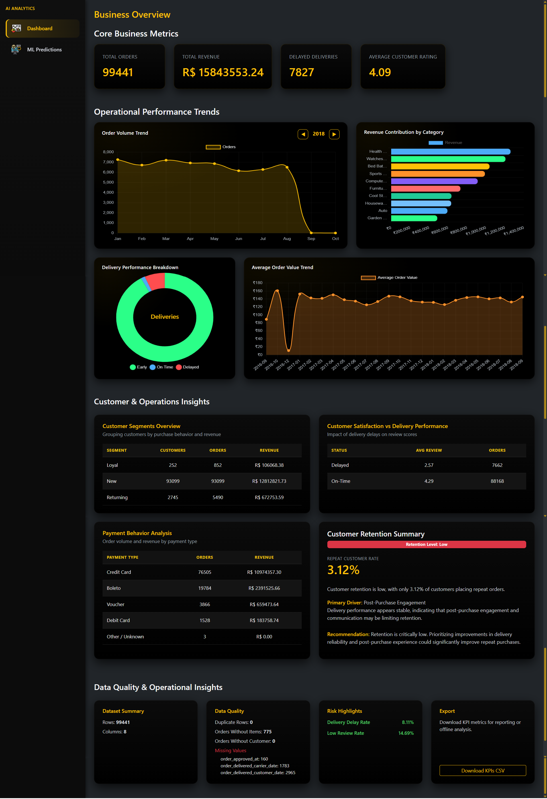
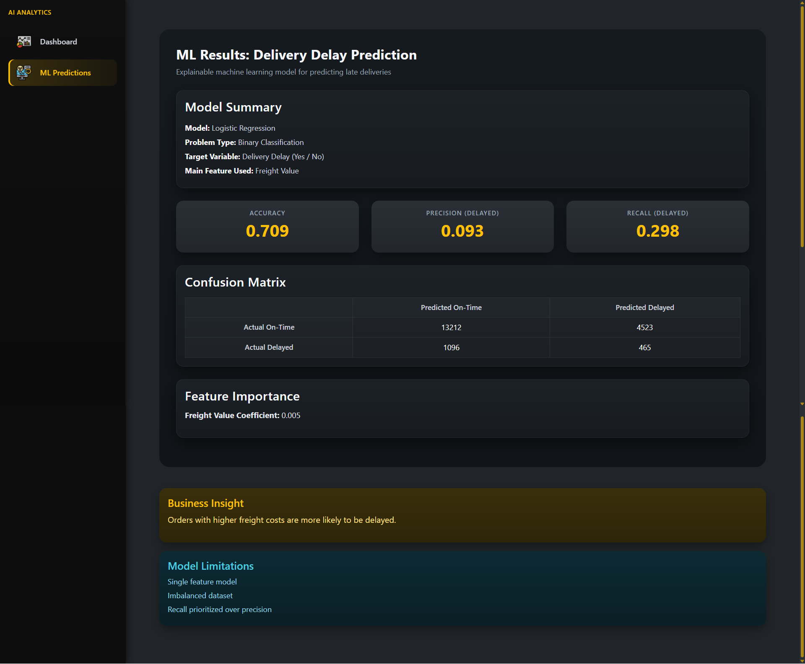

# E-Commerce Analytics Dashboard

## 📌 Overview

This project is a **Django-based analytics dashboard** built to analyze real-world
e-commerce data and generate **business insights** using data analytics and
**explainable machine learning**.

The dashboard simulates how analytics and ML are applied in a real production
e-commerce environment, with a strong focus on **data quality, business KPIs,
operational insights, and interpretability**.

---

## 📊 Dataset

**Olist Brazilian E-Commerce Public Dataset**

All **9 datasets** are used:

- orders
- customers
- order_items
- products
- order_reviews
- order_payments
- sellers
- product_category_name_translation
- geolocation

The dataset is treated as **production-grade data**, not a demo dataset.

---

## 🧱 Tech Stack

- Backend & Frontend: **Django (Templates)**
- Styling: **Bootstrap 5 (Dark Theme) + Custom CSS**
- Charts: **Chart.js**
- Data Processing: **Pandas, NumPy**
- Machine Learning: **Scikit-learn**
- Database: **SQLite (development)**

---

## 🖼️ Dashboard Preview

### Business Overview & KPIs

.png>)

### Operational Performance Trends

.png>)

### Customer & Operations Insights

.png>)

### Data Quality & Risk Highlights

.png>)

### Business Overview (Full Size)



### Machine Learning Results



---

## 📈 Core Features

### 1️⃣ Business KPIs

- Total Orders
- Total Revenue (product price + shipping cost)
- Delayed Orders
- Average Review Score

These KPIs provide a high-level view of overall business health.

---

### 2️⃣ Visual Analytics

- Orders over time
- Revenue by product category
- Delivery delay distribution
- Average Order Value Trend

---

### 3️⃣ Advanced Analytics (Tier-2)

- Customer segmentation (new, returning, loyal)
- Review score vs delivery delay analysis
- Payment method analysis
- Retention insights based on repeat purchases

---

### 4️⃣ Machine Learning (Explainable)

**Delivery Delay Prediction**

- Model: Logistic Regression
- Target: Delayed vs On-Time delivery
- Feature: Freight value (order-level)
- Metrics: Accuracy, Precision, Recall
- Confusion matrix and feature importance

---

### 5️⃣ Data Quality & Operational Checks (Tier-4)

- Dataset summary
- Missing value detection
- Duplicate record detection
- Broken relationship checks
- Operational risk flags

---

## 🧠 Architecture Highlights

- Clean Django project structure
- Dedicated services layer for analytics and ML
- Views used only for orchestration
- Business logic separated from presentation

---

## ▶️ How to Use

### 1️⃣ Clone the Repository

```bash
git clone https://github.com/Sriram-Harshit/ecommerce_analytics.git
cd ecommerce_analytics

```

### 2️⃣ Create and Activate Virtual Environment

```bash
python -m venv venv
source venv/bin/activate   # On Windows: venv\Scripts\activate
```

### 3️⃣ Install Dependencies

```bash
pip install -r requirements.txt
```

### 4️⃣ Prepare the Dataset

Place all 9 Olist CSV files inside:

```
data/default/
```

### 5️⃣ Run Database Migrations

```bash
python manage.py migrate
```

### 6️⃣ Start the Development Server

```bash
python manage.py runserver
```

### 7️⃣ Access the Dashboard

Open your browser and visit:

```
http://127.0.0.1:8000/
```

---

## 📌 Future Improvements (If Time Permits)

- Additional ML models (e.g., regression)
- Geographic analytics
- Scenario-based simulations
- Performance optimizations for larger datasets

---

## 🎯 Conclusion

This project demonstrates how **data analytics and machine learning** can be
combined to improve **operational efficiency, customer satisfaction, and
decision-making** in e-commerce systems.
